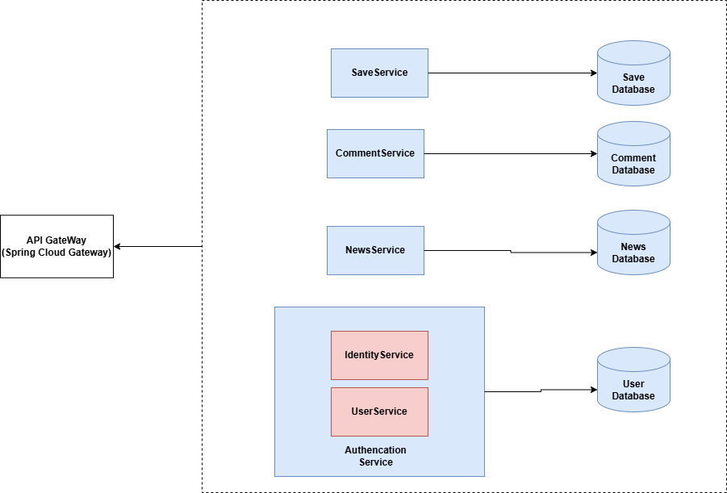
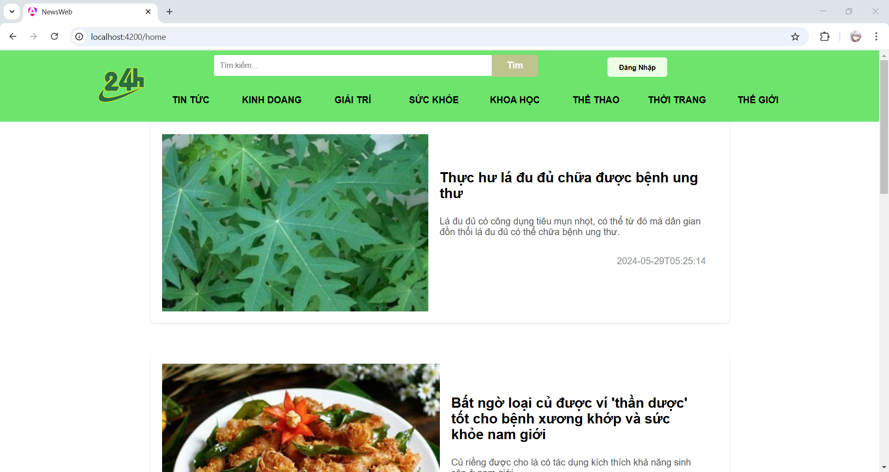
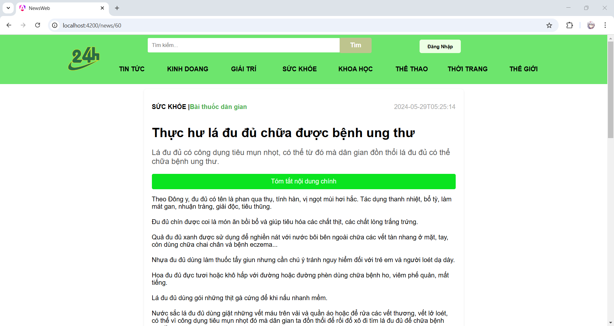
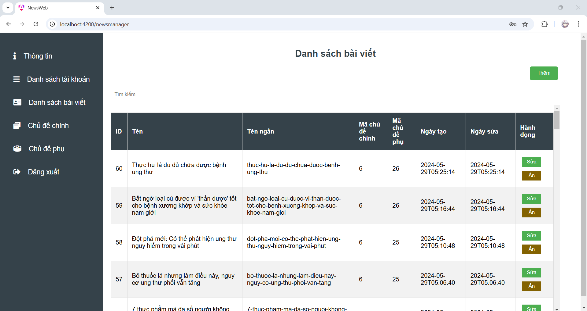

# Website xem tin tức

Dự án đơn giản nhằm mục đích học tập và tìm hiểu về microservice và Spring Framework.


# Mục lục
- [Cơ sở dữ liệu](#Cơ-sở-dữ-liệu)
- [Tổng quan về hệ thống Back-end](#Tổng-quan-về-hệ-thống-Back-end)
- [Tổng quan về giao diện](#Tổng-quan-về-giao-diện)
- [Cách khởi chạy back-end bằng Docker](#Cách-khởi-chạy-back-end-bằng-Docker)

## Cơ sở dữ liệu

Cơ sở dữ liệu được thiết kế đơn giản hóa như sau:


Với khá ít bảng, việc phân chia cơ sở dữ liệu là không cần thiết. Tuy nhiên, để nghiên cứu về kiến trúc microservice, nó được phân chia như sau:


## Tổng quan về hệ thống Back-end
Cách hoạt động back-end được mô tả trong hình sau


## Tổng quan về giao diện
Được viết bằng Angular. Phần này không được chi tiết lắm nhưng về cơ bản các chức năng vẫn hoạt động bình thường
### Trang Chủ

### Chi tiết tin tức

### Giao diện quản lý


## Cách khởi chạy back-end bằng Docker

#### Docker compose v1
Cập nhật các biến môi trường trong file service.env sau đó chạy.
````cmd
docker-compose --env-file service.env up -d
````
#### Docker compose v2
Thay thế biến môi trường trực tiếp trong file docker-compose.yml chạy
````cmd
docker compose up -d
````
