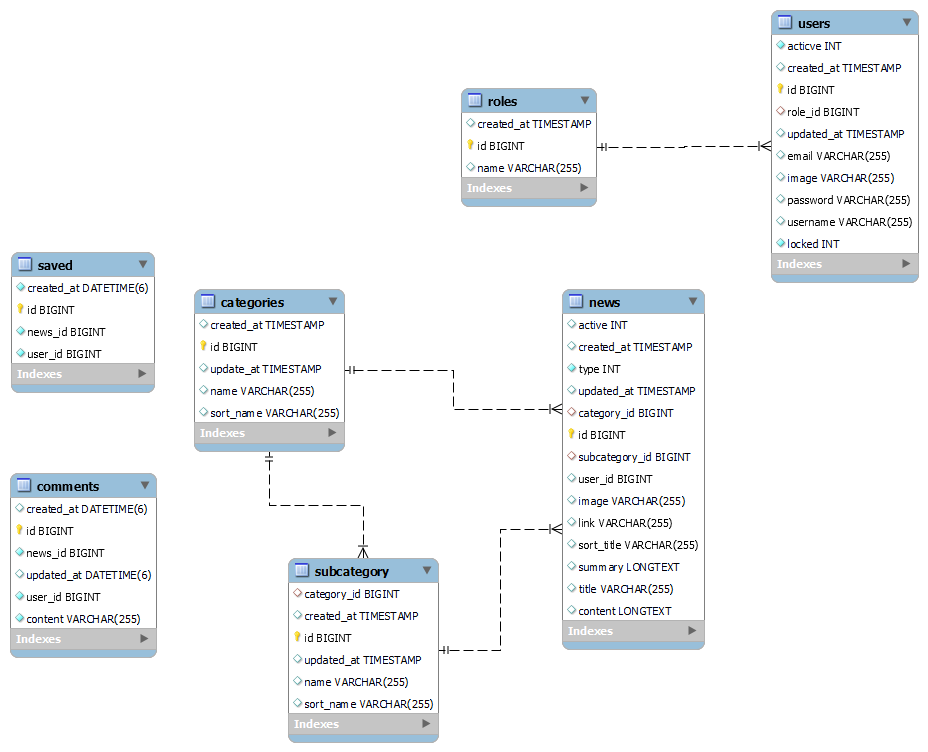

# Website xem tin tức

Dự án đơn giản nhằm mục đích học tập và tìm hiểu về microservice và Spring Framework.


## Cơ sở dữ liệu

Cơ sở dữ liệu được thiết kế đơn giản hóa như sau:


Với khá ít bảng, việc phân chia cơ sở dữ liệu là không cần thiết. Tuy nhiên, để nghiên cứu về kiến trúc microservice, nó được phân chia như sau:



## Cách khởi chạy trên Docker

#### Docker compose v1
Cập nhật các biến môi trường trong file service.env sau đó chạy.
````md
```
docker-compose --env-file service.env up -d
```
````
#### Docker compose v2
Thay thế biến môi trường trực tiếp trong file docker-compose.yml chạy
````md
```
docker compose up -d
```
````
